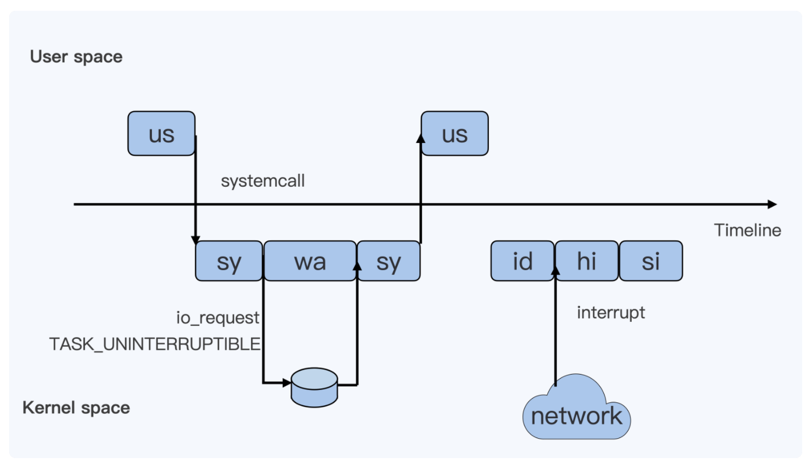
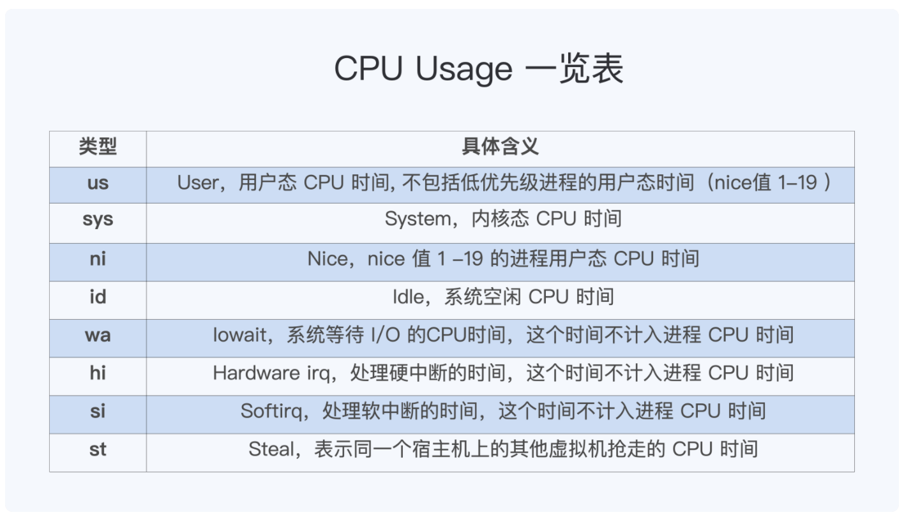
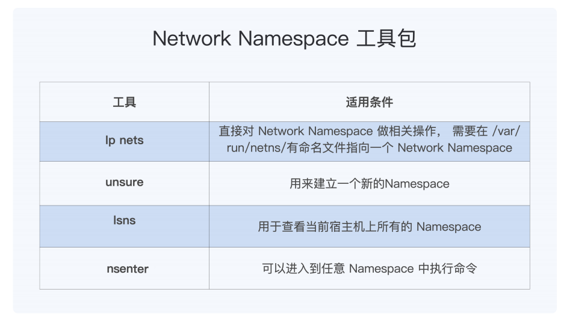

### 容器中的进程

1. 在容器中，1号进程永远不会响应SIGKILL和SIGSTOP这两个特权信号
2. 对于其他信号，如果用户或程序注册了handler，1号进程可以相应，比如：SIGTERM
3. 如果进程回收代码代码写的有问题，会导致容器内残留很多僵尸进程，最坏的情况会导致系统无法启动新进程，可以通过Cgroup控制容器最大进程数
4. 进程的不同状态

5. 每个进程的 CPU Usage 只包含用户态（us 或 ni）和内核态（sy）两部分，其他的系统 CPU 开销并不包含在进程的 CPU 使用中，而 CPU Cgroup 只是对进程的 CPU 使用做了限制。
6. CPU Cgroup 中的主要参数，包括这三个：cpu.cfs_quota_us，cpu.cfs_period_us 还有 cpu.shares。cpu.cfs_quota_us（一个调度周期里这个控制组被允许的运行时间）除以cpu.cfs_period_us（用于设置调度周期）得到的这个值决定了 CPU Cgroup 每个控制组中 CPU 使用的上限值；cpu.shares 这个值决定了 CPU Cgroup 子系统下控制组可用 CPU 的相对比例，不过只有当系统上 CPU 完全被占满的时候，这个比例才会在各个控制组间起作用。
7. Load Average= 可运行队列进程平均数 + 休眠队列中不可打断的进程平均数（在linux中）；当CPU使用率不高，但是Load Average比较高导致性能降低的情况，可以使用 ps aux | grep " D "命令查询系统中处于TASK_UNINTERRUPTIBLE状态的进程。

### 容器中的内存

1. 容器突然在系统中被杀掉，很可能是容器中的进程占用了太多的内存，超出了memory Cgroup的限制。可以使用docker inspect查看容器的OOMkilled状态为True。
2. 每个容器的 Memory Cgroup 在统计每个控制组的内存使用时包含了两部分，RSS（ Resident Set Size） 和 Page Cache。RSS 是每个进程实际占用的物理内存，它包括了进程的代码段内存，进程运行时需要的堆和栈的内存，这部分内存是进程运行所必须的。Page Cache 是进程在运行中读写磁盘文件后，作为 Cache 而继续保留在内存中的，它的目的是为了提高磁盘文件的读写性能。
3. RSS也叫匿名内存，发生swap的正式这部分内存，Page Cache是不会进行swap的。当需要在容器中需要禁止swap，可以设置容器Memery Cgroup中的memory.swappiness.

### 容器中的文件系统

1. 为了减少磁盘上冗余的镜像数据，同时减少镜像的网络传输时间，需要一种针对容器的文件系统，这类文件系统叫做UnionFS。比如：OverlayFS。
2. 为了防止容器将宿主机的磁盘写满，可以用 XFS Quota 来限制 OverlayFS 的 upperdir 目录来控制容器 OverlayFS 的根目录大小。docker run 启动容器的时候，加上一个参数 --storage-opt size= <SIZE> 就是使用的这种技术
3. 测试磁盘读写性能的工具：fio
4. Cgroup V1 的 blkiio 控制子系统，可以用来限制容器中进程的读写的 IOPS 和吞吐量（Throughput），但是它只能对于 Direct I/O 的读写文件做磁盘限速，对Buffered I/O的文件读写，它无法进行磁盘限速。这是因为 Buffered I/O 会把数据先写入到内存 Page Cache 中，然后由内核线程把数据写入磁盘，而 Cgroup v1 blkio 的子系统独立于 memory 子系统，无法统计到由 PageCache 刷入到磁盘的数据量。这个 Buffered I/O 无法被限速的问题，在 Cgroup v2 里被解决了。但是现实中容器平台还没有支持。
5. 在容器中用 Buffered I/O 方式写文件的时候，会出现写入时间波动的问题。由于这是 Buffered I/O 方式，对于写入文件会先写到内存里，这样就产生了 dirty
pages。当 dirty pages 数量超过 dirty_background_ratio 对应的内存量的时候，内核 flush 线程就会开始把 dirty pages 写入磁盘 ; 当 dirty pages 数量超过 dirty_ratio 对应的内存量，这时候程序写文件的函数调用 write() 就会被阻塞住，直到这次调用的 dirty pages全部写入到磁盘。这个问题也提醒了我们：在对容器做 Memory Cgroup 限制内存大小的时候，不仅要考虑容器中进程实际使用的内存量，还要考虑容器中程序 I/O 的量，合理预留足够的内存作为 Buffered I/O 的 Page Cache。

### 容器中的网络

1. Network Namespace 可以隔离网络设备，ip 协议栈，ip 路由表，防火墙规则，以及可以显示独立的网络状态信息。

2. 由于安全的原因，普通容器的 /proc/sys 是 read-only mount 的，所以在容器启动以后，我们无法在容器内部修改 /proc/sys/net 下网络相关的参数。这时可行的方法是通过 runC sysctl 相关的接口，在容器启动的时候对容器内的网络参数做配置。
3. 解决容器与外界通讯的问题呢，一共需要完成两步。第一步是，怎么让数据包从容器的Network Namespace 发送到 Host Network Namespace 上；第二步，数据包到了
Host Network Namespace 之后，还需要让它可以从宿主机的 eth0 发送出去。我们想让数据从容器 Netowrk Namespace 发送到 Host Network Namespace，可以用配置一对 veth 虚拟网络设备的方法实现。而让数据包从宿主机的 eth0 发送出去，就用可bridge+nat 的方式完成。遇到容器中网络不通的情况，我们先要理解自己的容器以及容器在宿主机上的配置，通过对主要设备上做 tcpdump 可以找到具体在哪一步数据包停止了转发。
4. 容器通常缺省使用 veth 虚拟网络接口，不过 veth 接口会有比较大的网络延时。我们可以使用 netperf 这个工具来比较网络延时，相比物理机上的网络延时，使用 veth 接口容器的网络延时会增加超过 10%。如果要减小容器网络延时，就可以给容器配置 ipvlan/macvlan 的网络接口来替代 veth 网络接口。对于延时敏感的应用程序，我们可以考虑使用 ipvlan/macvlan 网络接口的容器。不过，由于 ipvlan/macvlan 网络接口直接挂载在物理网络接口上，对于需要使用 iptables 规则的容器，比如 Kubernetes 里使用 service 的容器，就不能工作了。
5. veth可能会增加数据包乱序的几率，数据包乱序会导致快速重传。在把数据包分散到各个 CPU 时，RPS 保证了同一个数据流是在一个 CPU 上的，这样就可以有效减少包的乱序。那么我们可以把 RPS 的这个特性配置到 veth 网络接口上，来减少数据包乱序的几率。

### 容器的安全

1. Linux capabilities 就是把Linux root 用户原来所有的特权做了细化，可以更加细粒度地给进程赋予不同权限。每个 Linux 进程有 5 个 capabilities 集合参数，其中 Effective 集合里的 capabilities 决定了当前进程可以做哪些特权操作，而其他集合参数会和应用程序文件的 capabilities 集合参数一起来决定新启动程序的 capabilities 集合参数。对于容器的 root 用户，缺省只赋予了 15 个 capabilities。如果我们发现容器中进程的权限不够，就需要分析它需要的最小 capabilities 集合，而不是直接赋予容器"privileged"。
2. 为了减少安全风险，业界都是建议在容器中以非 root 用户来运行进程。不过在没有 UserNamespace 的情况下，在容器中使用非 root 用户，对于容器云平台来说，对uid 的管理会比较麻烦。所以，我们还是要分析一下 User Namespace，它带来的好处有两个。一个是把容器中root 用户（uid 0）映射成宿主机上的普通用户，另外一个好处是在云平台里对于容器 uid的分配要容易些。除了在容器中以非 root 用户来运行进程外，Docker 和 podman 都支持了 rootless container，也就是说它们都可以以非root 用户来启动和管理容器，这样就进一步降低了容器的安全风险。
