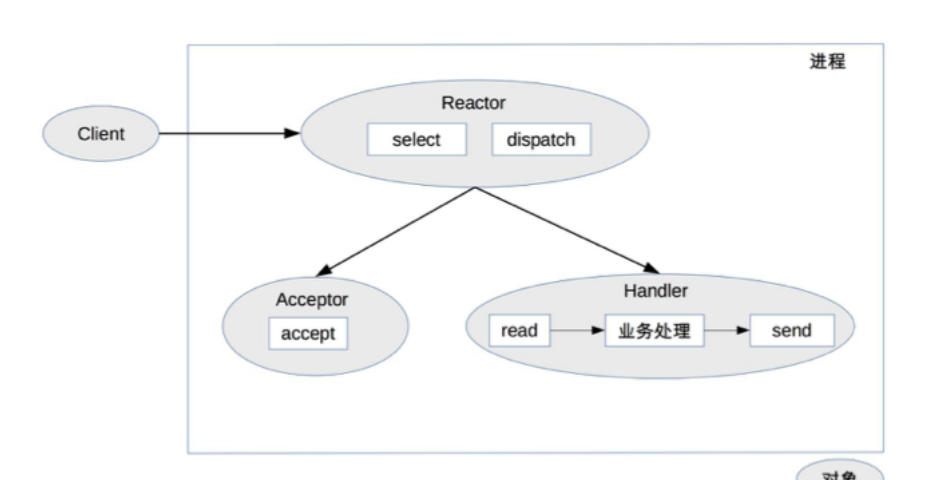
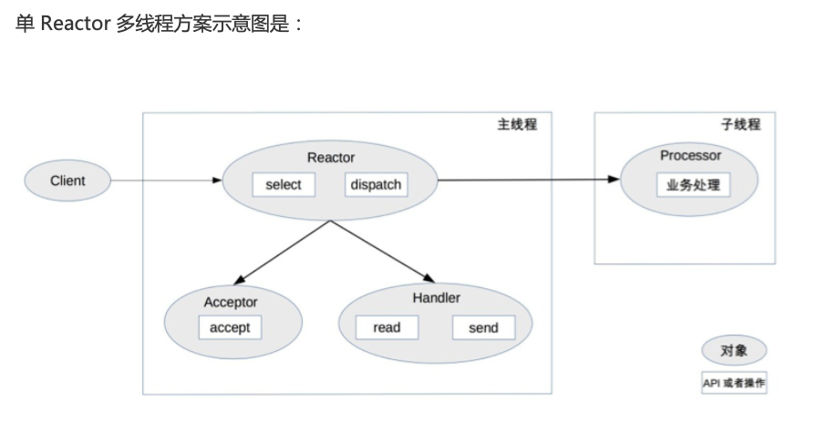
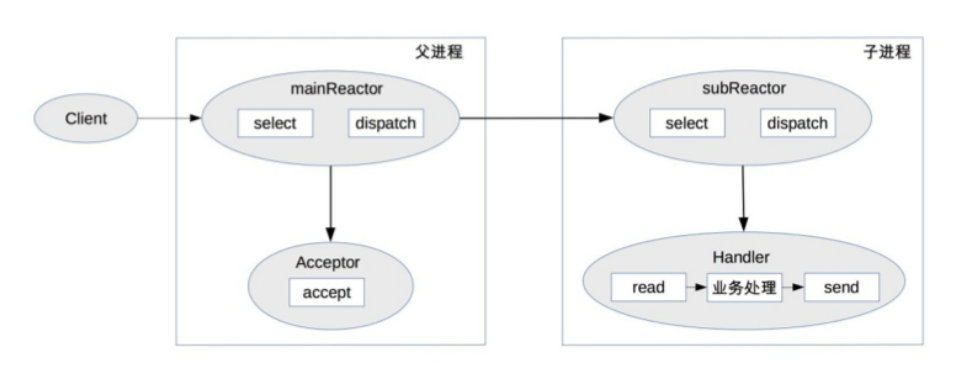
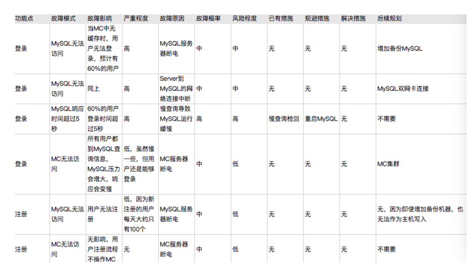

# 学习笔记

## 基础架构

1. IBM的BUP将软件架构视图分为著名的“4 + 1视图”(<https://developer.aliyun.com/article/496452>)
2. 为什么要做架构设计？架构设计的主要目的是为了解决软件系统复杂度带来的问题
3. 复杂度之高性能：单机高性能（需要考虑进程、线程模型等）和集群高性能（水平扩展、服务拆分等）
4. 架构设计3原则：合适胜于业界领先；简单优于复杂；演化优于一步到位（误区：希望软件设计一步到位，为了实现这样的目标，照搬大公司的方案；要么投入大量资源预测、分析、设计，并且很多预测和分析是不靠谱的）。
5. 架构设计流程：
   1). 识别复杂度
   2). 设计备选方案
   3). 评估和选择备选方案
   2). 详细方案设计

## 高性能架构模式

### 高性能数据库

**不要一上来就分库分表，读写分离。可以先做硬件优化（SSD），数据库配置优化，sql语句优化，引入缓存技术等**

#### 读写分离（读多写少的场景）

读写分离实现逻辑并不复杂，但两细节点将引入设计复杂度：**复制延迟**和**分配机制**
解决复制延迟的几种方法：

1. 写操作后的的读操作发送给主机。（对业务代码侵入较大）
2. 读从机失败后在读一次主机。（实现代价较小，但是将大大增加主机的读操作压力，比如：黑客暴力破解账号，会导致大量的二次读操作）
3. 关键业务读写操作都指向主机，非关键业务读写分离。

分配机制指将读写操作开，访问不同的服务器，一般有两种方式：**代码封装**和**中间件封装**

#### 分库分表

分库，业务分库是指按照不同的业务模块将数据拆分到不同的库中。这样虽然分担了存储和访问压力，但是也会有新的问题：

1. join操作，原本在同一个库中的不同表被分配到不同的库中，导致无法使用SQL的join操作。
2. 事务问题，虽然数据库厂商提供分布式事务，但是性能较低，与高性能的目标相违背。
3. 成本问题，需要更多的服务器。

分表，分为**垂直分表**和**水平分表**
垂直分表比较简单，就是将不常用且占用大量空间的列拆分出去。
水平查分比较复杂，需要考虑路由算法（范围路由、hash路由、配置路由），join操作（需要业务代码多次join，然后结果合并），count操作（count相加，记录表数），order by操作（查询每个子表，然后汇总排序）。实现方式也有两种方式：**代码封装**和**中间件封装**。

#### NoSQL

NoSQL并不是银弹，需要在合适的场景引入像：Redis、Mongo、Hbase、ES等。

### 高性能缓存

通过上述手段可以提升存储系统的性能，但是某些场景下单纯依靠存储系统的性能提升是不够的，比如：需要通过复杂运算得到的数据，读多写少的场景(读写分离可以一定程度上解决)。这个时候可以考虑增加缓存。

### 单服务器高性能

#### PPC（process per connection）

最大并发量只有几百

#### TPC（thread per connection）

并发量也只有几百

#### Reactor和Proactor

Reactor，其实就是io多路复用 + 进程池/线程池，根据Reactor和进程/线程的数量分为以下几种模式：

1. 单Reactor + 单进程/单线程：无法利用多核，适合业务处理非常快的场景，如：redis
   
2. 单Reactor + 多线程：可以利用多核的特性，Reactor承担所有的事件监听和相应，在主线程中运行，在瞬间高并发的情况下可能会成为性能瓶颈
   
3. 多Reactor + 多进程/多线程：Nginx采用的是多Reactor多进程模式，Memcache和Netty采用的是多Reactor多线程模式。
   

Proactor，Reactor 是非阻塞同步网络模型，因为真正的 read 和 send 操作都需要用户进程同步操作。这里的“同步”指用户进程在执行 read 和 send 这类 I/O 操作的时候是同步的，如果把 I/O 操作改为异步就能够进一步提升性能，这就是异步网络模型 Proactor。

理论上 Proactor 比 Reactor 效率要高一些，异步 I/O 能够充分利用 DMA 特性，让 I/O操作与计算重叠，但要实现真正的异步 I/O，操作系统需要做大量的工作。目前 Windows下通过 IOCP 实现了真正的异步 I/O，而在 Linux 系统下的 AIO 并不完善，因此在 Linux下实现高并发网络编程时都是以 Reactor 模式为主。

### 负载均衡高性能

#### DNS负载均衡

DNS 是最简单也是最常见的负载均衡方式，一般用来实现地理级别的均衡。
优点：

- 简单成本低
- 就近访问，提升速度

缺点：

- 更新不及时，DNS缓存时间较长
- 扩展性差
- 分配策略简单

#### 硬件负载均衡

目前业界典型的硬件负载均衡设备有两款：F5 和 A10。这类设备性能强劲、功能强大，但价格都不便宜，一般只有“土豪”公司才会考虑使用此类设备。
优点：

- 功能强大：全面支持各层级的负载均衡，支持全面的负载均衡算法，支持全局负载均衡。
- 性能强大：对比一下，软件负载均衡支持到 10 万级并发已经很厉害了，硬件负载均衡可以支持 100 万以上的并发。
- 稳定性高：商用硬件负载均衡，经过了良好的严格测试，经过大规模使用，稳定性高。
- 支持安全防护：硬件均衡设备除具备负载均衡功能外，还具备防火墙、防 DDoS 攻击等安全功能。

缺点：

- 价格昂贵：最普通的一台 F5 就是一台“马 6”，好一点的就是“Q7”了。
- 扩展能力差：硬件设备，可以根据业务进行配置，但无法进行扩展和定制。

#### 软件负载均衡

软件负载均衡通过负载均衡软件来实现负载均衡功能，常见的有 Nginx 和 LVS，其中Nginx 是软件的 7 层负载均衡，LVS 是 Linux 内核的 4 层负载均衡。4 层和 7 层的区别就在于协议和灵活性，Nginx 支持 HTTP、E-mail 协议；而 LVS 是 4 层负载均衡，和协议无关，几乎所有应用都可以做，例如，聊天、数据库等。软件和硬件的最主要区别就在于性能，硬件负载均衡性能远远高于软件负载均衡性能。Ngxin 的性能是万级，一般的 Linux 服务器上装一个 Nginx 大概能到 5 万 / 秒；LVS 的性能是十万级，据说可达到 80 万 / 秒；而 F5 性能是百万级，从 200 万 / 秒到 800 万 / 秒都有（数据来源网络，仅供参考，如需采用请根据实际业务场景进行性能测试）。
优点：

- 简单：无论是部署还是维护都比较简单。
- 便宜：只要买个 Linux 服务器，装上软件即可。
- 灵活：4 层和 7 层负载均衡可以根据业务进行选择；也可以根据业务进行比较方便的扩展，例如，可以通过 Nginx 的插件来实现业务的定制化功能。

缺点：

- 性能一般：一个 Nginx 大约能支撑 5 万并发。
- 功能没有硬件负载均衡那么强大。
- 一般不具备防火墙和防 DDoS 攻击等安全功能。

#### 负载均衡算法

负载均衡算法包括：轮询、加权轮询、负载最低优先、性能最优类、Hash类。

## 高可用架构模式

### CAP理论

在一个分布式系统（**指互相连接并共享数据的节点的集合**）中，当涉及读写操作时，只能保证一致性（Consistence）、可用性（Availability）、分区容错性（Partition Tolerance）三者中的两个，另外一个必须被牺牲。但放到分布式环境下来思考，我们会发现必须选择 P（分区容忍）要素，因为网络本身无法做到 100% 可靠，有可能出故障，所以分区是一个必然的现象。如果我们选择了 CA 而放弃了 P，那么当发生分区现象时，为了保证C，系统需要禁止写入，当有写入请求时，系统返回 error（例如，当前系统不允许写入），这又和 A 冲突了，因为 A 要求返回 no error 和 no timeout。因此，分布式系统理论上不可能选择 CA 架构，只能选择 CP 或者 AP 架构。

CAP关注的粒度是数据，而不是整个系统。所以在 CAP 理论落地实践时，我们需要将系统内的数据按照不同的应用场景和要求进行分类，每类数据选择不同的策略（CP 还是 AP），而不是直接限定整个系统所有数据都是同一策略。

正常运行情况下，不存在 CP 和 AP 的选择，可以同时满足 CA。这就要求架构设计的时候既要考虑分区发生时选择 CP 还是 AP，也要考虑分区没有发生时如何保证 CA。

### 排除可用性利器：FMEA方法

在架构设计领域，FMEA 的具体分析方法是：

- 给出初始的架构设计图。
- 假设架构中某个部件发生故障。
- 分析此故障对系统功能造成的影响。
- 根据分析结果，判断架构是否需要进行优化。

如：

### 存储高可用

如：主备、主从、主主、集群、分区。

### 计算高可用

如：主备、主从、集群

### 业务高可用

异地多活

### 应对接口故障

常用的手段有：降级、熔断、限流、排队

## 可扩展架构模式

### 微服务

微服务有哪些坑：

1. 服务划分过细，服务见关系复杂
2. 服务数量太多，团队效率急剧下降
3. 调用链太长，性能下降
4. 调用链太长，问题定位困难
5. 没有自动化支撑，无法快速交付
6. 没有服务治理，微服务多了后台管理混乱

微服务最佳实践：

1. 服务粒度：可以基于团队规模拆分，建议3个人开发一个服务。
2. 拆分方法：基于业务逻辑拆分；基于可扩展性拆分；基于可靠性拆分；基于性能拆分。
3. 基础设施：必不可少，不然微服务会演变成开发、测试、运维的灾难
   - 服务发现、服务路由、服务容错：这是最基本的微服务基础设施。
   - 接口框架、API 网关：主要是为了提升开发效率，接口框架是提升内部服务的开发效率，API 网关是为了提升与外部服务对接的效率。
   - 自动化部署、自动化测试、配置中心：主要是为了提升测试和运维效率。
   - 服务监控、服务跟踪、服务安全：主要是为了进一步提升运维效率。

